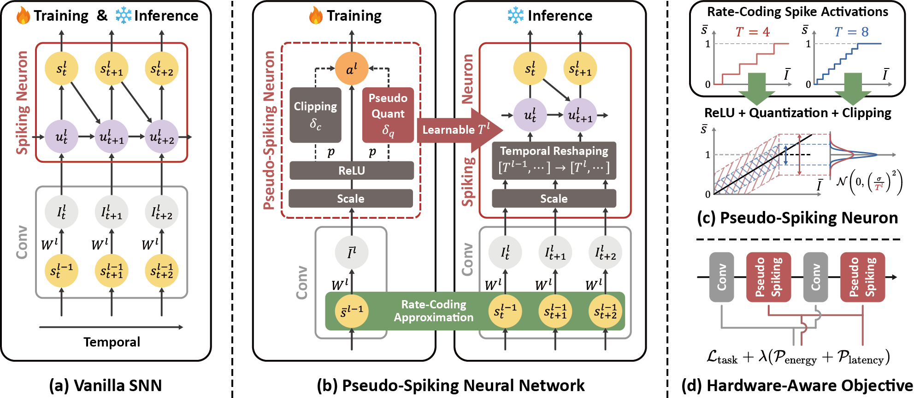

# Pseudo-Spiking Neurons

<div align="center">
  
  <a href="https://www.aaai.org">
    
  </a>
  <a href="https://pytorch.org/">
    
  </a>
  <a href="https://github.com/yourusername/PseudoSNN/blob/main/LICENSE">
    
  </a>

  **A Noise-Based Training Framework for Heterogeneous-Latency Spiking Neural Networks**
  
  <div>
    <strong>Yuxuan Zhang</strong><sup>1</sup>, 
    <strong>Yuhang Sun</strong><sup>1,2</sup>, 
    <strong>Hongjue Li</strong><sup>1</sup>, 
    <strong>Yue Deng</strong><sup>1,2</sup>, 
    <strong>Wen Yao</strong><sup>3*</sup>
  </div>

  <small>
  <sup>1</sup>Beihang University, 
  <sup>2</sup>Beijing Zhongguancun Academy, 
  <sup>3</sup>Defense Innovation Institute, CAMS
  </small>
</div>

<br/>

<p align="center">
  
</p>

## 📖 Abstract

Spiking Neural Networks (SNNs) promise significant energy efficiency by processing information via sparse, event-driven spikes. However, realizing this potential is hindered by the conventional use of a rigid, uniform timestep, $T$. This constraint imposes a challenging trade-off between accuracy and latency, while also incurring the prohibitive training costs of Backpropagation Through Time (BPTT). To overcome this limitation, we introduce the Pseudo-Spiking Neuron (PseudoSN), a novel training proxy that conceptualizes latency as an intrinsic, learnable parameter for each neuron. Building on the efficiency of rate-based methods, the PseudoSN models temporal dynamics in a single, BPTT-free pass. It employs a learnable probabilistic noise scheme to emulate the discretization effects of spike generation (e.g., clipping and quantization), making the neuron-specific timestep—and thus latency—directly optimizable via backpropagation. Integrated into a hardware-aware objective, our framework trains heterogeneous-latency SNNs that autonomously learn to optimize the trade-offs among accuracy, latency and energy, establishing a new state-of-the-art on major benchmarks.

## 📂 Project Structure

```text
PseudoSNN/
├── configs/            # Configuration files (YAML) for different datasets/models
│   ├── noisy/          # Configs for PseudoSNN (Noise-based training)
│   └── vanilla/        # Configs for baseline SNNs
├── figs/               # Figures and assets
├── models/             # SNN model definitions (ResNet, VGG, SEW-ResNet, etc.)
├── neuron/             # Pseudo-Spiking Neuron and Multi-Spike implementations
├── scripts/            # Shell scripts for reproducing experiments
├── utils/              # Data loading, augmentation, and helper functions
├── main.py             # Main training and evaluation script
└── requirements.txt    # Python dependencies
```

## 🛠️ Installation

1. **Clone the repository:**
```bash
git clone https://github.com/deng-ai-lab//PseudoSNN.git
cd PseudoSNN
```


2. **Create a virtual environment (Recommended):**
```bash
conda create -n pseudosnn python=3.10
conda activate pseudosnn
```


3. **Install dependencies:**
```bash
# We recommend installing PyTorch manually to ensure the correct CUDA version
pip install torch==2.5.1 torchvision==0.20.1 torchaudio==2.5.1 --index-url (https://download.pytorch.org/whl/cu121)
pip install -r requirements.txt
```


## 🚀 Usage

### Data Preparation

Please organize your datasets (CIFAR-10, CIFAR-100, ImageNet, CIFAR10-DVS) in a directory. By default, the code expects the data path to be passed via arguments or config.

### Training

You can run the training script using `main.py`. The configurations are managed via YAML files in the `configs/` directory.

**Basic execution:**

```bash
python main.py --config configs/noisy/cf10/r18.yaml --data_path /path/to/cifar10
```

**Key Arguments:**

* `--config`: Path to the YAML config file.
* `--penalty`: The coefficient  for the hardware-aware objective (latency & energy penalty).
* `--use_noise`: Set to `True` to enable PseudoSN training.
* `--data_type`: Dataset name (e.g., `cifar10`, `cifar100`, `imagenet`, `cifar10_dvs`).

### Reproducing Results

We provide shell scripts in the `scripts/` directory to reproduce the main results from the paper.

**Example: Train ResNet-18 on CIFAR-10**

```bash
bash scripts/cf10.sh
```

> **Note:** You may need to modify the `CUDA_VISIBLE_DEVICES` or script paths inside the `.sh` files to match your environment.*

### Evaluation
To evaluate a pre-trained model on the test set without training, use the `--test_only` flag combined with `--resume` to specify the checkpoint path.

**Command:**
```bash
python main.py --config configs/noisy/cf10/r18.yaml \
    --resume output/cifar10/noisy_r18/checkpoint_max_test_acc1.pth \
    --test_only
```

**Key Arguments:**

* `--config`: Ensure this matches the configuration used during training (to correctly initialize the model architecture).
* `--resume`: Path to the model checkpoint (`.pth`) you wish to load.
* `--test_only`: Skips the training loop and runs the evaluation on the test dataset immediately.

## 📊 Results

PseudoSNN achieves state-of-the-art performance across multiple datasets with learned heterogeneous latency.

| Method | Architecture | CIFAR-10 Acc (T) | CIFAR-100 Acc (T) | ImageNet Acc (T) | CIFAR10-DVS Acc (T) |
| :--- | :--- | :--- | :--- | :--- | :--- |
| **PseudoSNN** | **VGG-11** | **95.80±0.04** <br> (3.22±0.12) | **78.50±0.16** <br> (3.28±0.06) | - | **79.82±0.79** <br> (4.50±0.14) |
| **PseudoSNN** | **ResNet-18** | **95.94±0.12** <br> (3.91±0.10) | **78.66±0.25** <br> (4.01±0.06) | - | - |
| **PseudoSNN** | **ResNet-19** | 96.62±0.02 <br> (3.46±0.05) | 81.29±0.11 <br> (3.01±0.03) | - | - |
| **PseudoSNN** | **SEW-ResNet-34** | - | - | **68.18±0.25** <br> (4.03±0.29) | - |
| **PseudoSNN** | **PreAct-ResNet-34** | - | - | **69.78±0.17** <br> (4.23±0.10) | - |

> **Note:** Values are formatted as **Top-1 Accuracy %** (Average Timesteps $T$). Results show mean ± standard deviation over 4 independent runs. Bold values indicate SOTA performance compared to baselines in the paper.

## 🛡️ License

This project is released under the [MIT License](https://www.google.com/search?q=LICENSE).

## 🙏 Acknowledgements

This work is based on the [SpikingJelly](https://github.com/fangwei123456/spikingjelly) framework. We thank the contributors for their open-source efforts.
